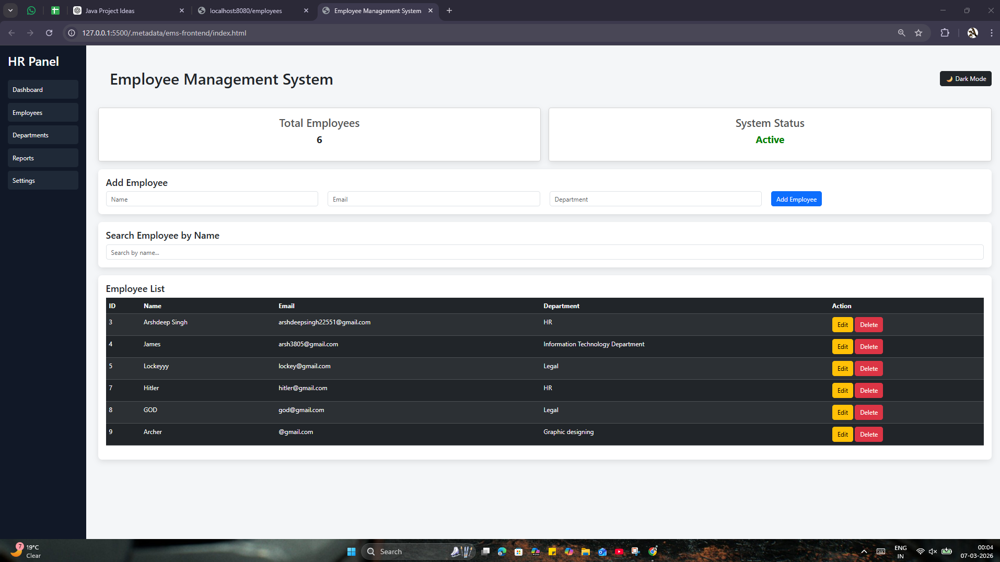
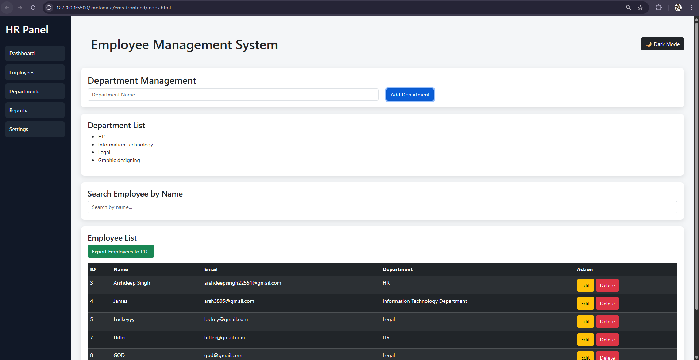
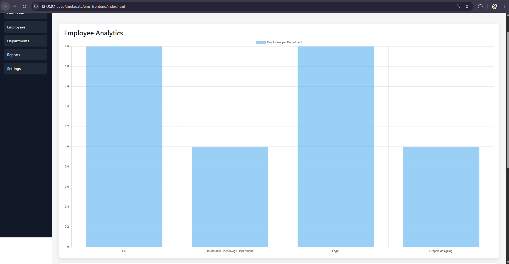
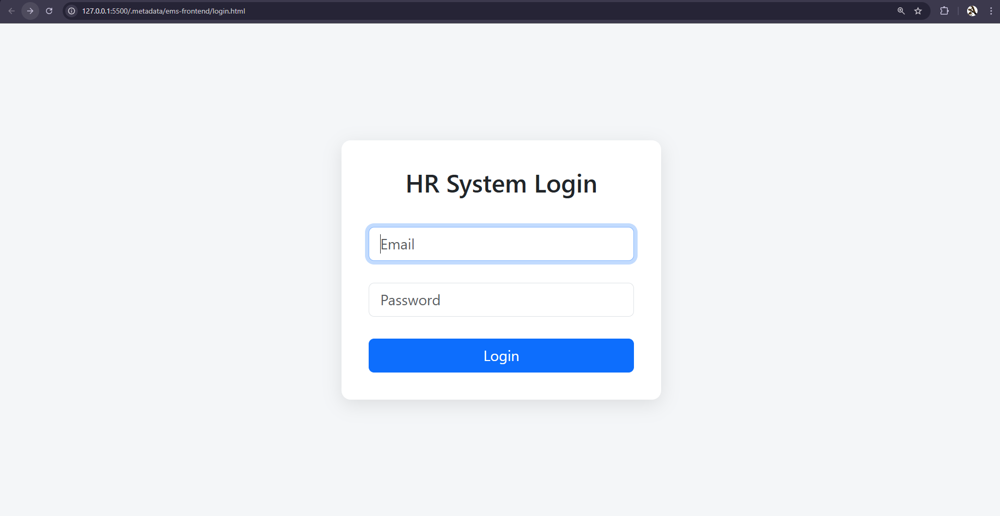

# 🚀 Employee Management System Dashboard


A full-stack **HR management dashboard** built using **Spring Boot, MySQL, and Vanilla JavaScript**.

The system allows administrators to manage employees, departments, analytics reports, and export employee data as PDF — all through a modern dashboard interface.

---

## 💼 Business Value

- Centralized employee management
- Simplifies HR operations
- Provides analytics for decision making
- Generates downloadable reports
- Clean admin dashboard for HR teams

---

## 🔥 Key Features
### 👥 Employee Management

- Add employee
- Edit employee
- Delete employee
- Search employees instantly
- View employee list

### 🏢 Department Management

- Create departments
- Organize employees by department

### 📊 Analytics Dashboard

- Total employee count
- Department statistics
- Chart-based reports

### 📄 Reporting

- Export employee data to PDF report

### 🔐 Authentication

- Simple admin login system

### 🎨 UI Features

- Modern admin dashboard
- Sidebar navigation
- Dark mode toggle
- Responsive layout

---

## 🏗 System Architecture

```bash
User (Browser)
      │
      ▼
Frontend UI (HTML + CSS + JS + Bootstrap)
      │
      ▼
REST API Calls
      │
      ▼
Spring Boot Backend
      │
      ▼
Service Layer
      │
      ▼
JPA Repository
      │
      ▼
MySQL Database
```

---

## 🔷 Application Flow

```bash
User Login
   │
   ▼
Admin Dashboard
   │
   ├── Employee Management
   │       ├ Add
   │       ├ Edit
   │       └ Delete
   │
   ├── Department Management
   │
   ├── Reports & Analytics
   │
   └── Export Employee Data (PDF)
```
---

## 📸 Screenshots

### Dashboard


### Departments


### Reports


### Login


---

## 🖥 Run Locally

### 1️⃣ Start Backend
```bash
cd backend
mvn spring-boot:run
```
---

Backend runs on:
```bash
http://localhost:8080
```

### 2️⃣ Start Frontend

Open frontend folder and run with Live Server or open:
```bash
frontend/index.html
```

---

## 📈 Tech Stack
```bash
| Layer    | Technology            |
| -------- | --------------------- |
| Backend  | Java + Spring Boot    |
| Database | MySQL                 |
| Frontend | HTML, CSS, JavaScript |
| Charts   | Chart.js              |
| Reports  | jsPDF                 |
| Styling  | Bootstrap             |
```

---

## 📂 Project Structure
```bash
Employee-Management-System
│
├── backend
│   └── Spring Boot Application
│
├── frontend
│   ├── index.html
│   ├── login.html
│   ├── style.css
│   └── script.js
│
└── README.md
```

---

## 📌 Future Improvements

- JWT Authentication
- Role Based Access (Admin / HR)
- Email Notifications
- CSV Employee Import
- Cloud Deployment
- Employee Profile Page

---

## 🎯 Project Goal

Build a modern HR dashboard that demonstrates:

  - Full-stack development
  - REST API design
  - Dashboard UI development
  - Data visualization
  - Report generation

---

## 👨‍💻 Author

Arshdeep Singh

AI / Software Developer

---

## GitHub
```bash
https://github.com/arshdeepsarsh
```

---

⭐ If you found this project useful

Give it a star on GitHub ⭐
